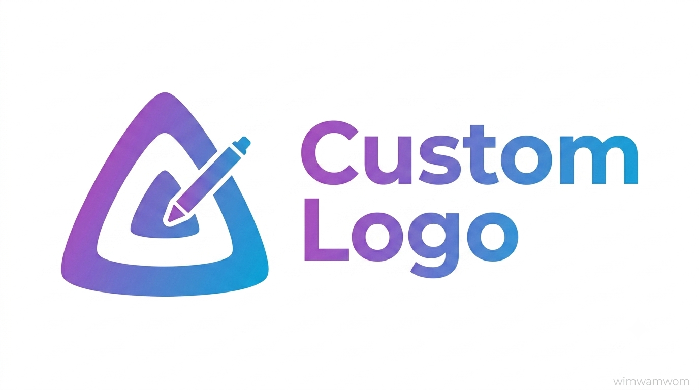

<h1 align="center">Jellyfin Custom Logo Plugin</h1>

<p align="center">
Replace the default Jellyfin branding with your own logo and header text. Configured entirely from
the admin dashboard.
</p>
<p align="center">
  
</p>

---

## What it replaces

| Target | Element |
| --- | --- |
| Splash / loading logo | `.splashLogo`: the large logo shown while the web client boots |
| Header logo | `.pageTitleWithDefaultLogo`, including the TV layout |
| Header text | Drawn next to the header logo, optionally hidden on narrow screens |
| Admin drawer logo | `.adminDrawerLogo img` |
| Favicon | Favicon, `apple-touch-icon` and tile icon |

Each target can be switched on individually, or you can flip the whole plugin between **all logos**,
**only the ones you select**, and **nothing at all**.

## Installation

### From the plugin repository (recommended)

1. In Jellyfin go to **Dashboard → Plugins → Repositories** and add:

   ```
   https://raw.githubusercontent.com/WimWamWom/jellyfin-plugin-custom-logo/main/manifest.json
   ```

2. Open **Dashboard → Plugins → Catalog**, find **Custom Logo**, and install it.
3. Restart Jellyfin.

### Manually

1. Download `custom-logo_<version>.zip` from the [releases page][releases].
2. Extract it into `<jellyfin-data>/plugins/Custom Logo/`.
3. Restart Jellyfin.

## Configuration

Open **Custom Logo** in the dashboard's left-hand navigation, set a logo (URL or upload) and a header
text, and save. Changes apply on the next full page load. Reload with <kbd>Ctrl</kbd>+<kbd>F5</kbd>
(<kbd>Cmd</kbd>+<kbd>Shift</kbd>+<kbd>R</kbd> on macOS).

Freshly installed, the plugin does nothing until you give it a logo or header text.

## Requirements

Jellyfin **10.11.x**.

---

📖 **[Full documentation](DOCUMENTATION.md)**: how the injection works, every setting explained,
using it alongside your own custom CSS and other plugins, security, building and releasing.

## License

[GPL-3.0](LICENSE)

[releases]: https://github.com/WimWamWom/jellyfin-plugin-custom-logo/releases
